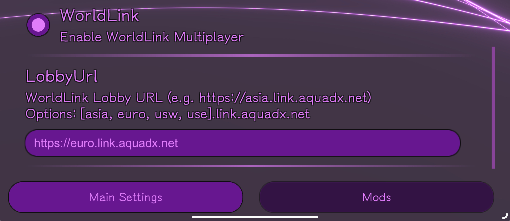
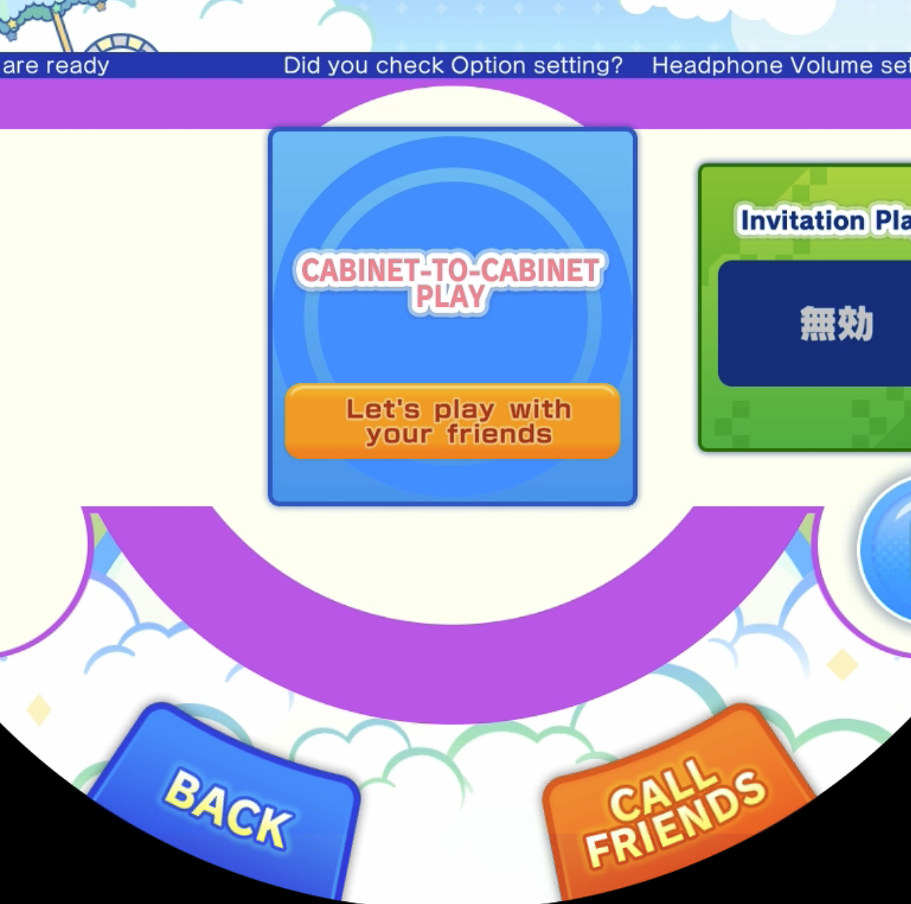
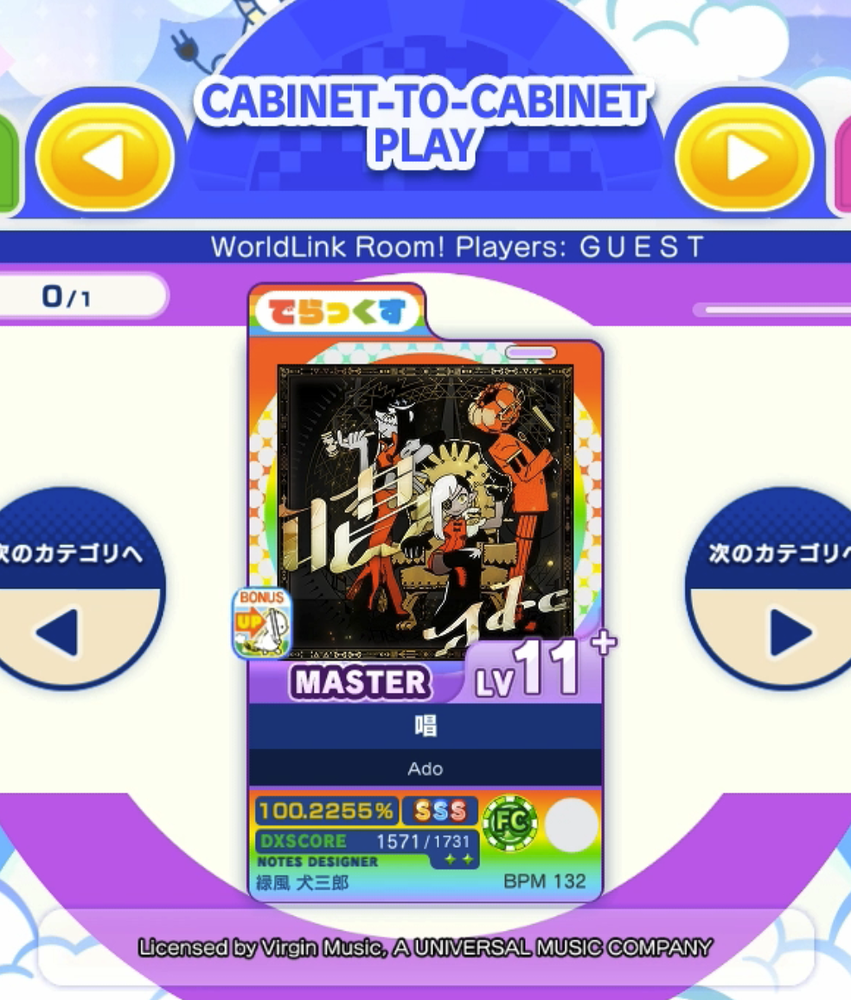

WorldLink 是一个模组，使玩家能够与全球的朋友或随机玩家进行实时的机台对机台多人游戏。该模组最初由 AquaDX 团队开发，并已集成到 KanadeDX 中。

### 1. 设置方法

要使用 WorldLink，你需要 **250306.0850** 或更高版本的 KanadeDX。在启动游戏前，请在启动器设置中启用 **WorldLink 模组**。

#### 选择服务器

选择离你最近的大厅服务器，以获得最佳连接质量。可用服务器如下：

- 🇺🇸 **美国西部**: `usw.link.aquadx.net`
- 🇺🇸 **美国东部**: `use.link.aquadx.net`
- 🇪🇺 **欧洲**: `eu.link.aquadx.net`
- 🇯🇵 **亚洲**: `asia.link.aquadx.net`
- 🇨🇳 **中国**: `cn.link.aquadx.net`

不同服务器上的房间**不会**相互显示，因此请确保所有玩家加入相同的服务器。

> **注意:** 由于设计限制，所有房间均为公共房间。如果你想进行私人游戏，可以参考 [worldlinkd 自托管指南](https://github.com/MewoLab/worldlinkd/blob/main/README.HOST.md) 自行托管服务器。

### 2. 游戏方法

设置好 WorldLink 后，按照以下步骤进行游戏：

1. 选择歌曲，并进入 **机台对机台模式**。
2. 点击 **呼叫好友** 来创建多人游戏房间。

创建房间

你的朋友可以在歌曲选择界面的 **机台对机台模式** 选项下查找你的房间并加入。

加入房间

每位玩家可以选择自己的难度等级。当所有玩家准备就绪后，游戏将自动开始。

> **限制:**  
> - 每个房间最多支持 **两名玩家**。  
> - 由于原游戏设计，暂不支持额外玩家加入。
